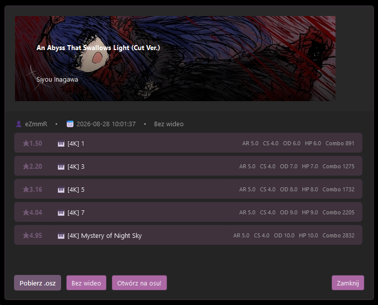

🎵 osu!finder
A fast, simple and modern osu! beatmap finder for desktop.

  
 
 <strong>Search · Preview · Download · Import</strong> 
 
     
 
 <a href="https://github.com/jakubic769/OsuFinder/releases"> <strong>⬇️ Download</strong> </a> &nbsp;&nbsp;•&nbsp;&nbsp; <a href="https://github.com/jakubic769/OsuFinder/issues"> <strong>🐛 Report a Bug</strong> </a> &nbsp;&nbsp;•&nbsp;&nbsp; <a href="https://github.com/jakubic769/OsuFinder"> <strong>⭐ Star the Project</strong> </a> 
 

🎯 About

osu!finder is a lightweight desktop application designed to make finding and downloading osu! beatmaps quick and convenient.

Search for a beatmap, preview its details, choose the difficulty you want, and download the .osz file — all from one simple interface.

🎵 No osu! account required.

✨ Features
<table> <tr> <td width="50%">
🔎 Beatmap Search

Search beatmaps by:

Title
Artist
Mapper
Difficulty
</td> <td width="50%">
🎮 Multiple Game Modes

Supports all major osu! game modes:

🖱️ osu!
🥁 Taiko
🍎 Catch
⌨️ Mania
</td> </tr> <tr> <td width="50%">
⭐ Difficulty Filters

Filter maps using:

Star difficulty
Minimum difficulty
Maximum difficulty
</td> <td width="50%">
📊 Status Filters

Find maps by status:

🟢 Ranked
💗 Loved
🔵 Qualified
🟡 Pending
⚫ Graveyard
</td> </tr> <tr> <td width="50%">
🖼️ Beatmap Details

View detailed information including:

Cover art
Artist
Title
Mapper
Difficulty
Beatmap status
</td> <td width="50%">
⬇️ Easy Downloads

Download .osz files directly from the application and open them in osu!

</td> </tr> <tr> <td width="50%">
📦 File Import

Import existing beatmaps from:

.osz
.zip
.7z
.rar
</td> <td width="50%">
🎨 Custom Themes

Customize the application with:

Accent colors
Text colors
Backgrounds
Opacity
Panels & borders
Theme presets
</td> </tr> <tr> <td width="50%">
🌍 Multiple Languages

Currently available in:

🇬🇧 English
🇵🇱 Polish
🇩🇪 German
🇷🇺 Russian
</td> <td width="50%">
⚡ Modern UI

Built with a focus on:

Smooth animations
Responsive interface
Keyboard navigation
Clean desktop experience
</td> </tr> </table>
📸 Screenshots
🏠 Main Window

  

🎵 Beatmap Details

  

📥 Installation
🪟 Windows

The easiest way to use osu!finder is to download the latest .exe release.

1. Go to the Releases page.

2. Download the latest osu-finder.exe.

3. Run the application.

That's it. No Python installation required.

🐍 Run from Source
Requirements
Python 3.11+
Git
1. Clone the repository
git clone https://github.com/jakubic769/OsuFinder.git
cd OsuFinder

2. Create a virtual environment

Windows:

python -m venv .venv
.venv\Scripts\activate

macOS / Linux:

python3 -m venv .venv
source .venv/bin/activate

3. Install dependencies
pip install -r requirements.txt

4. Start osu!finder
python osu_finder.py

🧠 How It Works

osu!finder keeps the process simple:

┌──────────────┐
│    Search    │
└──────┬───────┘
       │
       ▼
┌──────────────────────┐
│ osu! Beatmap API     │
│       (Mirror)       │
└──────────┬───────────┘
           │
           ▼
┌──────────────────────┐
│   Beatmap Results    │
└──────────┬───────────┘
           │
           ▼
┌──────────────────────┐
│    Choose a Map      │
└──────────┬───────────┘
           │
           ▼
┌──────────────────────┐
│     Download .osz    │
└──────────┬───────────┘
           │
           ▼
┌──────────────────────┐
│     Open in osu!     │
└──────────────────────┘

The application uses a public osu! API mirror and does not require an osu! account.

🎨 Customization

Make osu!finder
